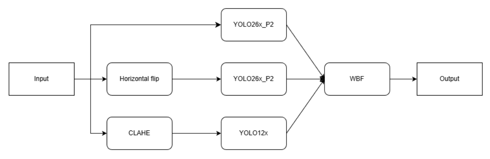

# Head Detection & Counting in Classroom Scenes

Hệ thống phát hiện và đếm đầu người trong lớp học sử dụng YOLO thế hệ mới + Ensemble Inference, tập trung vào môi trường lớp học đông đúc (occlusion cao, ánh sáng phức tạp, đầu nhỏ ở hàng sau).

[](https://www.python.org/)
[](https://github.com/ultralytics/ultralytics)
[](https://opensource.org/licenses/MIT)

## Giới thiệu

Trong môi trường lớp học đông đúc, việc quản lý sĩ số và giám sát hoạt động gặp nhiều khó khăn. Đếm thủ công tốn thời gian và thiếu chính xác. Camera giám sát phổ biến nhưng chưa được khai thác hiệu quả bằng AI.

**Thách thức chính**:
- Đầu người nhỏ (tiny objects) ở hàng sau hoặc góc xa
- Occlusion nặng (che khuất bởi bàn ghế, bạn học)
- Ánh sáng không đồng đều (ngược sáng từ cửa sổ + đèn huỳnh quang)
- Góc chụp đa dạng → biến dạng phối cảnh

**Mục tiêu dự án**:
- Xây dựng hệ thống head detection chính xác, robust cho môi trường lớp học.
- Sử dụng **YOLO26x với P2 head** (tối ưu small objects) + **YOLO12x + CLAHE** (tăng tương phản ánh sáng kém).
- Ensemble 3 nguồn (ảnh gốc + flip TTA + CLAHE) bằng **Weighted Boxes Fusion (WBF)** để giảm sai số đếm.
- Đánh giá trên **SCUT-HEAD Part A** (in-domain) và **Classroom-Data** (out-of-domain, thực tế).

## Bộ dữ liệu

- **SCUT-HEAD Part A** (huấn luyện + test in-domain):  
  - Nguồn: [GitHub HCIILAB/SCUT-HEAD](https://github.com/HCIILAB/SCUT-HEAD-Dataset-Release)  
  - 2.000 ảnh lớp học, 67.321 heads annotated (bounding box YOLO-style).  
  - Phân chia: Train 1.100 + Valid 400 + Test 500.

- **Classroom-Data** (đánh giá thực tế):  
  - Nguồn: [Kaggle Classroom-Data](https://www.kaggle.com/datasets/harinivasganjarla/classroom-data)  
  - 547 ảnh lớp học thực tế (sau lọc), 446 ảnh có người (count > 0).  
  - Chỉ có nhãn count (số lượng người), không bounding box → dùng cho counting error metrics.

## Phương pháp đề xuất

### Mô hình
- **Model 1**: YOLO26x-P2 (custom detection head stride=4 cho tiny heads) – NMS-free, end-to-end, tối ưu edge.
- **Model 2**: YOLO12x (attention-centric: Area Attention A², R-ELAN, FlashAttention) – tốt global context & occlusion.

### Tiền xử lý & Augmentation
- CLAHE trên kênh L của LAB (clip_limit=2.0, tile=16×16) → chỉ cho YOLO12x.
- Horizontal Flip TTA (inference).
- Aug mạnh: mosaic=1.0, copy_paste=0.4, mixup=0.2, scale=0.6.

### Huấn luyện
- Chỉ trên SCUT-HEAD Part A (single-class 'head').
- Siêu tham số khác biệt cho từng model (imgsz 800/640, batch 4/8, freeze 10/2 layers).
- Optimizer: AdamW, AMP, early stopping patience=20.

### Inference Ensemble
- 3 nguồn:  
  1. YOLO26x-P2 trên ảnh gốc (conf=0.1)  
  2. YOLO26x-P2 trên ảnh flip (conf=0.1)  
  3. YOLO12x trên ảnh CLAHE (conf=0.075)  
- Hợp nhất bằng **Weighted Boxes Fusion** (weights=[2.5, 1.0, 1.2], IOU_thr=0.5, absent_model_aware_avg, final conf > 0.2).
- imgsz=768 khi inference.

**Sơ đồ pipeline tổng thể** (bao gồm tiền xử lý, 3 nguồn dự đoán và WBF fusion):


*Hình: Sơ đồ pipeline suy luận ensemble với 3 nguồn đầu vào và Weighted Boxes Fusion.*

### Metrics
- Counting: **MAE**, **RMSE**, **MAPE** (%)  
- Detection (SCUT-HEAD test): **mAP@0.5**  
- Thời gian suy luận (GTX 1650 4GB): mean ~0.45s/ảnh (p95 ~0.46s).

## Kết quả nổi bật

| Dataset              | MAE    | RMSE   | MAPE (%) | mAP@0.5 | Inference mean (s) |
|----------------------|--------|--------|----------|---------|---------------------|
| SCUT-HEAD test       | 1.422  | 2.846  | 4.64     | 0.949   | 0.430                   |
| Classroom-Data (thực tế) | 1.762  | 2.647  | 5.43     | -       | 0.449               |

- Sai số đếm trung bình ~1.4–1.8 người/lớp → rất tốt cho lớp học đông đúc.
- Domain shift nhẹ (MAPE tăng ~17%) → khả năng tổng quát hóa ổn định.
- Thời gian suy luận ~0.45 giây/ảnh trên GTX 1650 → khả thi triển khai thực tế (camera giám sát lớp học).

## Cài đặt & Chạy project

### Yêu cầu
- Python 3.10+
- Ultralytics >=8.3 (hỗ trợ YOLO12 & YOLO26)
- OpenCV, torch, ensemble_boxes, numpy, pandas

```bash
# Clone repo
git clone https://github.com/DuongNguyenTung2204/classroom-people-counting.git
cd classroom-people-counting

# Cài đặt dependencies
pip install -r requirements.txt

# Chạy API
python main.py